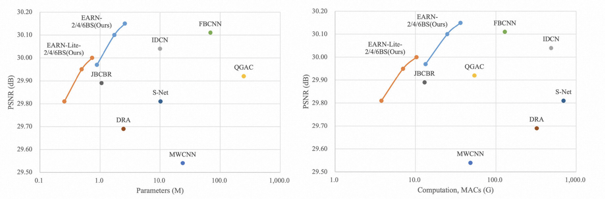

# EARN
The source code of paper "EARN: toward efficient and robust JPEG compression artifact reduction", https://link.springer.com/article/10.1007/s00371-023-03008-4

## Results
As shown below, EARN can effectively reduce the artifacts generated by JPEG compression and achieved state-of-the-art restoration performance with less computational costs and network parameters.

<center> JPEG Quality=10 </center>
<br/>


<center> EARN Restored </center>
<br/>


<center> Performance vs Parameters and Computation </center>
<br/>

## Guide

### Environment
For preparing running environment, run
```shell
conda env create -f EARN_env.yaml
```

### Inference/Test
For inferencing or testing, run 
```shell
python Inference_Metric_RGB.py
```
or 
```shell
python Inference_Metric_Y.py
```
depending on the image type (color or gray).
Demonstration inference results are shown in "./results" folder and our pretrained models are provided as "model_RGB.pth" and "model_Y.pth".

### Train
For training, first construct your own training dataset. Please refer to "./LIVE1" and "./LIVE1_Y" folders for scripts and demonstrations about the how to construct it. Then change the dataset path in "Train_RGB.py" or "Train_Y.py" and run
```shell
python Train_RGB.py
```
or
```shell
python Train_Y.py
```
according to your dataset type (color or gray).

References
Please cite our paper if the repository helps you.
```txt
Teng, G., Jiang, R., Liu, X. et al. EARN: toward efficient and robust JPEG compression artifact reduction. Vis Comput (2023). https://doi.org/10.1007/s00371-023-03008-4
```